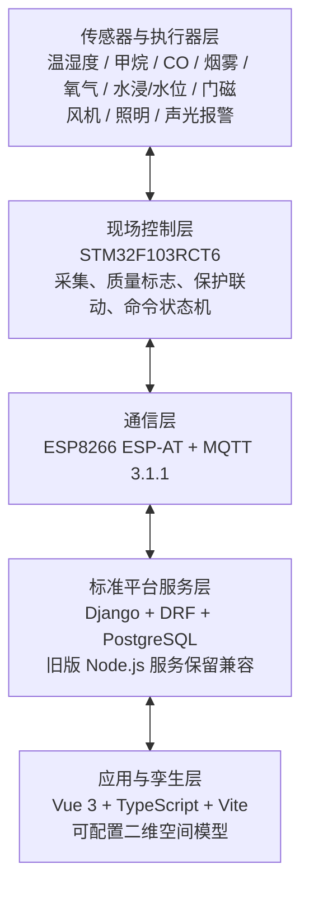

<div align="center">

# 综合管廊数字孪生运维实体样品

[](docs/%E7%BB%BC%E5%90%88%E7%AE%A1%E5%BB%8A%E6%95%B0%E5%AD%97%E5%AD%AA%E7%94%9F%E8%BF%90%E7%BB%B4%E5%AE%9E%E4%BD%93%E6%A0%B7%E5%93%81%E9%A1%B9%E7%9B%AE%E8%AE%A1%E5%88%92%E4%B9%A6_V2.7.docx)


</div>

面向教室桌面展示的综合管廊数字孪生运维样品，通过真实传感、STM32 现场控制、MQTT 数据链路和 Web 三维可视化，形成“监测—报警—联动—工单—处置—复核—归档”的完整运维闭环。

> [!IMPORTANT]
> 当前软件平台已完成 P0–P3 软件交付：`frontend` 提供 Vue 3 本地演示与 Django API 数据源切换，`backend` 提供登录、RBAC、资产、可信遥测批量接入、遥测历史统计、自动阈值告警、工单、阈值、导出登记、审计与运维健康检查 API。数据洞察可按资产、指标、质量和采集时间查询 PostgreSQL 历史并展示聚合趋势。`apps/web` 与 `services/api` 作为旧版兼容基线保留。真实托管数据库连接信息仍需部署时配置；本阶段的软件演示无需硬件。

> [!NOTE]
> 软件平台的实际功能、运行方式、质量门禁和后续 PostgreSQL 接入说明见 [软件平台说明](docs/software-platform.md)。本文其余内容保留为 V2.6 总体规划基线。

> [!TIP]
> 当前新增的标准工程栈位于 `frontend/`（Vue 3）和 `backend/`（Django + DRF），可独立启动并连接 PostgreSQL；原有 `apps/web` 与 `services/api` 保持不动，迁移说明和运行命令见 [Vue 3 + Django 标准软件栈](docs/vue-django-stack.md)。

## 目录

- [项目概览](#项目概览)
- [业务目标](#业务目标)
- [范围与边界](#范围与边界)
- [系统架构](#系统架构)
- [核心功能](#核心功能)
- [技术选型](#技术选型)
- [数据与接口约定](#数据与接口约定)
- [项目结构](#项目结构)
- [快速开始](#快速开始)
- [实施计划](#实施计划)
- [质量与验收](#质量与验收)
- [安全要求](#安全要求)
- [协作与版本管理](#协作与版本管理)
- [文档](#文档)
- [许可证与保密](#许可证与保密)

## 项目概览

| 项目属性 | 内容 |
| --- | --- |
| 项目名称 | 综合管廊数字孪生运维实体样品 |
| 规划版本 | V2.7（实物清单、燃气管道泄漏、渗水监测与华为云部署基线版） |
| 计划周期 | 2026-08-25 至 2026-09-30 |
| 阶段目标 | 2026-09-10 前完成 MVP；2026-09-30 前完成全部交付 |
| 现场主控 | STM32F103RCT6 |
| 部署方式 | 展示电脑本地服务 + 局域网热点或路由器 |
| 运行原则 | 核心功能不依赖公网，断网时现场保护与局域网业务仍可运行 |
| 当前状态 | 软件 P0–P3 已完成并可本地或 API 模式演示；STM32 台架与托管数据库按部署条件继续接入 |

项目的成功标准包括：实体与三维对象编码一致、真实采集与真实控制、异常事件全流程留痕、局域网连续稳定运行，以及代码、硬件、模型、部署和测试资料可复现。

## 业务目标

- 建立实体设备、传感器、区域与三维模型之间的一一映射。
- 真实采集温湿度、甲烷、CO、烟雾、氧气、积水/水位、门磁及设备状态。
- 真实控制风机、照明和声光报警，并接收执行回执。
- 在统一界面完成三维定位、报警确认、联动查看、工单流转和恢复关闭。
- 保留报警、控制、处置、复核和关闭的完整审计记录。
- 提供可重复演示、可测试、可部署并可继续扩展的工程基线。

### 运维闭环


## 范围与边界

### 本期范围

| 工作域 | 建设内容 |
| --- | --- |
| 实体结构 | 综合管廊舱体、管线支架、少量滴水演示点与接水盘、多气体监测安装位、设备节点、照明、检修口和控制箱 |
| 现场控制 | 采集、滤波、质量标志、阈值、状态机、联动、命令校验、故障保护、通信和日志 |
| 平台软件 | MQTT 接入、设备台账、实时数据、报警、工单、控制、历史曲线、审计和配置 |
| 数字孪生 | Web 三维模型、编码映射、状态着色、告警定位、设备弹窗、联动动画和视角导航 |
| 运维业务 | 监测、预警、报警、确认、派单、处置、复核、关闭、查询和统计 |
| 工程交付 | PCB 接口板、接线图、BOM、部署资料、测试记录、演示材料、源代码和项目文档 |

### 不在本期范围内

- 供水、排水、燃气等其他独立管网业务平台。
- 面向真实城市部署的防爆、消防、计量等认证，以及 SCADA 替代。
- UWB 人员定位、机器人、无人机、区块链和大数据集群。
- 公网高可用、移动 App、多租户和大规模设备接入。
- 甲烷、液化气、丁烷等可燃气体及任何明火、高压水喷射演示。

> [!WARNING]
> 本项目仅用于教学展示和运维信息流验证，不是经认证的生命安全或工业控制设备。样品阈值不得直接用于真实管廊。

## 系统架构



### 架构原则

- **现场安全优先**：急停、过流、过温、气体和高水位保护不依赖网络。
- **命令有据可查**：控制命令必须包含唯一 `cmdId`、超时、去重和执行回执。
- **数据质量显式表达**：离线或异常数据使用质量标志，不以数值 `0` 代替。
- **配置与代码分离**：阈值、持续时间、联动策略和三维映射均可配置、可版本化。
- **统一资产编码**：实体标签、数据库 `asset_id`、MQTT `nodeId` 和 GLB 网格名称保持一致。

## 核心功能

### 功能基线

- 传感采集、设备状态和数据质量管理。
- 网络不可用时的本地安全联动。
- 设备远程控制、互锁、超时和回执。
- 设备台账、区域、测点、执行器和模型映射管理。
- 三维状态着色、告警聚焦、设备详情和联动动画。
- 预警/报警/紧急三级事件及确认、恢复、关闭和合并。
- 报警转工单、责任人、时限、处置、复核与归档。
- 历史趋势、事件时间线、运行统计和 CSV 导出。
- 用户角色、关键配置变更和控制操作审计。

### 核心演示场景

| 场景 | 真实触发方式 | 自动联动 |
| --- | --- | --- |
| 多气体异常 | 甲烷、CO、氧气传感器真实在线；隔离信号模拟盒生成越限值 | 三维定位、风机和声光报警 |
| 管廊渗水/积水 | 从顶板/侧壁预设渗水点向独立透明接水盘滴入不超过 50mL 清水 | 定位 `SEEP-W01`、声光报警、停止滴水并人工吸水复位 |
| 燃气管道泄漏 | 预设裂缝点 `LEAK-G01` 可见；甲烷传感器真实在线，隔离信号模拟盒输出越限值 | 定位 `PIPE-G01 / LEAK-G01`、风机、声光报警和燃气泄漏工单 |
| 温度异常 | 使用低压限温加热片缓慢升温 | 启动风机、告警并关闭加热源 |
| 烟雾报警 | 使用合规烟感测试气雾 | 声光报警并按配置执行通风策略 |
| 风机故障 | 模拟转速反馈丢失或机械停转 | 设备故障报警并限制自动重启 |
| 非授权开门 | 无有效运维任务时开启检修门 | 入口告警与照明联动 |
| 通信中断 | 断开 Wi-Fi 或通信模块供电 | 现场保护保持，平台设备置灰并生成通信报警 |

### 用户角色

| 角色 | 主要权限 |
| --- | --- |
| 访客/展示人员 | 查看三维、实时值、历史记录和演示场景 |
| 值班员 | 确认报警、执行授权控制、创建工单和填写记录 |
| 运维员 | 接单、处置、上传结果和申请关闭 |
| 管理员 | 管理设备、阈值、用户、场景、映射、日志和数据 |

所有关键操作必须写入审计日志，关键联动解除需要二次确认并记录原因。

## 技术选型

| 层次 | 技术 | 说明 |
| --- | --- | --- |
| 主控制器 | STM32F103RCT6 + STM32CubeF1 HAL | 负责实时采集、控制、保护和现场联动 |
| 通信模块 | ESP8266 ESP-AT | 通过 UART 连接 STM32，原型阶段承担 MQTT 通信 |
| 消息协议 | MQTT 3.1.1 / Eclipse Mosquitto | 遥测使用 QoS 0；命令、报警与状态使用 QoS 1 |
| 后端 | Django 4.2 + Django REST Framework | 当前主软件栈，提供 Token 认证、RBAC、业务状态机、审计和 API；Node.js 服务保留兼容 |
| 数据库 | PostgreSQL（正式）/ SQLite（本地开发回退） | 资产、遥测、告警、工单、配置与审计的唯一主数据库 |
| 前端 | Vue 3 + TypeScript + Vite | 当前主软件栈，提供本地演示与 Django API 数据源切换；React 旧版保留兼容 |
| 数字孪生 | Vue 3 可配置二维空间模型 | 已完成资产定位、状态联动和异常高亮；GLB/Three.js 三维模型作为后续增强 |
| GIS | Leaflet 1.9.4 + WGS84 GeoJSON | 独立显示实物模块位置、坐标来源和固件接入状态；空间对象经导入、审核、发布与审计后进入运维地图，演示坐标与现场测绘严格区分 |
| 资产主数据 | Vue 3 + Django 事务 API | 管理员维护设备身份、能力、孪生/GIS 坐标和生命周期；乐观锁、停用保护与审计留痕 |

## 数据与接口约定

### MQTT 主题

| 主题 | 方向 | QoS / Retain | 用途 |
| --- | --- | --- | --- |
| `ut/v1/ctrl-01/telemetry` | 设备 → 平台 | `0 / false` | 周期遥测 |
| `ut/v1/ctrl-01/state` | 设备 → 平台 | `1 / true` | 设备、执行器、固件和保护状态 |
| `ut/v1/ctrl-01/alarm` | 设备 → 平台 | `1 / false` | 现场报警及恢复事件 |
| `ut/v1/ctrl-01/cmd` | 平台 → 设备 | `1 / false` | 控制和参数命令 |
| `ut/v1/ctrl-01/cmd_ack` | 设备 → 平台 | `1 / false` | 命令接收及执行回执 |
| `ut/v1/ctrl-01/status` | 设备 → 平台 | `1 / true` | 在线状态及遗嘱消息 |

实时接入：兼容 API 可订阅本地 MQTT、写入 PostgreSQL 后以认证 SSE 推送到旧版 React 前端；当前主入口为 Vue 3 + Django，报文格式与本地验证步骤见 [实时遥测接入说明](docs/实时遥测接入说明.md)。

### 编码规范

- 区域编码：`UT-ZA`、`UT-ZB`、`UT-ZC`。
- 资产编码：类别与序号组合，例如 `FAN-01`、`PIPE-G01`、`LEAK-G01`、`SEEP-W01`、`GAS-01`。
- 三维网格：使用资产编码，例如 `MESH_FAN_01`。
- 服务端时间：ISO 8601，必须包含时区。
- 单位：`degC`、`%RH`、`%LEL`、`ppm`、`%VOL`、`rpm`、`A` 等固定枚举。
- QoS 1 消息：使用 `eventId` 或 `cmdId` 去重。

详细 JSON 报文、I/O 分配和数据库设计以 [V2.6 项目计划书](docs/%E7%BB%BC%E5%90%88%E7%AE%A1%E5%BB%8A%E6%95%B0%E5%AD%97%E5%AD%AA%E7%94%9F%E8%BF%90%E7%BB%B4%E5%AE%9E%E4%BD%93%E6%A0%B7%E5%93%81%E9%A1%B9%E7%9B%AE%E8%AE%A1%E5%88%92%E4%B9%A6_V2.6.docx)为准。

## 项目结构

### 当前仓库

```text
utility-tunnel-digital-twin/
├── apps/web/              # 可操作的数字孪生运维前端
├── services/api/          # Fastify + PostgreSQL 业务 API 与迁移
├── firmware/stm32f103rct6/ # STM32CubeMX/CMake 台架固件
├── .github/workflows/     # Web/API 自动质量检查
├── docs/                  # 项目计划书、设计与软件使用说明
├── .gitignore
└── README.md
```

### 目标结构

```text
utility-tunnel-digital-twin/
├── firmware/              # STM32CubeIDE 工程、驱动、协议和固件发布
├── hardware/              # 原理图、PCB、Gerber、接线图和结构加工文件
├── model/                 # Blender、GLB、纹理和资产映射
├── apps/web/              # React/vinext 兼容前端（旧版入口）
├── services/api/          # Node.js 后端、MQTT 接入和数据库迁移
├── deploy/                # Mosquitto、环境配置、启停和备份脚本
├── docs/                  # 需求、设计、接口、测试、部署和演示文档
├── test/                  # 测试数据、自动化脚本和验收证据索引
└── README.md
```

目录应随模块进入实施阶段逐步创建，不应使用空目录暗示功能已经交付。

## 快速开始

### 软件演示（无需硬件）

```bash
git clone https://github.com/x1ng-chen/utility-tunnel-digital-twin.git
cd utility-tunnel-digital-twin
cd apps/web
npm ci
npm run dev
```

浏览器打开终端提示的本地地址即可体验告警确认、工单闭环、设备筛选、数字孪生定位、角色权限、审计和 CSV/JSON 导出。演示模式数据仅保留在当前页面运行期；选择 Django API 模式后，业务数据统一由 Django 写入 PostgreSQL（本地开发可回退 SQLite）。详细配置见 [软件平台说明](docs/software-platform.md) 与 [API 契约](docs/api-contract.md)。

### STM32 台架固件

固件接线、环境、编译、烧录和当前验证边界见 [firmware/stm32f103rct6/README.md](firmware/stm32f103rct6/README.md)。

克隆后建议阅读：

1. [软件平台说明](docs/software-platform.md)
2. [V2.6 项目计划书](docs/%E7%BB%BC%E5%90%88%E7%AE%A1%E5%BB%8A%E6%95%B0%E5%AD%97%E5%AD%AA%E7%94%9F%E8%BF%90%E7%BB%B4%E5%AE%9E%E4%BD%93%E6%A0%B7%E5%93%81%E9%A1%B9%E7%9B%AE%E8%AE%A1%E5%88%92%E4%B9%A6_V2.6.docx)
3. [STM32F103RCT6 台架固件说明](firmware/stm32f103rct6/README.md)
4. 本 README 中的范围、安全要求和协作规范

## 实施计划

| 里程碑 | 目标日期 | 完成标准 |
| --- | --- | --- |
| M0 需求与架构冻结 | 2026-08-27 | 需求、场景、尺寸、BOM、接口 v0.1 和采购基线完成 |
| M1 台架打通 | 2026-08-31 | STM32 完成首批采集与控制，Web 骨架和三维白模完成 |
| M2 数据链路 | 2026-09-04 | ESP8266、MQTT、入库、WebSocket 和三维映射贯通 |
| M3 场景集成 | 2026-09-07 | 至少四个真实场景端到端贯通 |
| MVP 验收 | 2026-09-10 | 采集、定位、报警、联动、确认、工单和恢复闭环完成 |
| M4-M6 完整实施 | 2026-09-22 | PCB、最终实体、七个场景、互锁和稳定性测试完成 |
| M7-M8 交付候选 | 2026-09-28 | 缺陷收敛，文档、部署包、视频和汇报材料完成 |
| 最终验收 | 2026-09-30 | 完整演示、清单会签、备份、标签和交付完成 |

日期来自 V2.6 基线。范围或节点变化必须通过变更记录评估后更新 README 和项目计划书。

## 质量与验收

### 关键指标

- 遥测到三维更新的 P95 延迟不超过 2 秒。
- 控制命令到执行回执不超过 2 秒。
- 报警条件满足到平台展示不超过 3 秒。
- 局域网连续运行 4 小时无崩溃。
- 30 分钟综合场景遥测缺失率不高于 1%。
- Wi-Fi 恢复后 15 秒内自动重连。
- 核心场景能够连续演示 3 次成功。

### 测试层级

单元/台架测试 → 接口测试 → 集成测试 → 场景测试 → 系统测试 → 最终验收。

P0 阻断和 P1 严重缺陷在最终验收前必须清零。测试记录至少包含版本、日期、环境、步骤、实际值、截图或视频、结果和测试人。

## 安全要求

- 实体样品全部采用低压供电；急停应能从硬件层切断相关执行器。
- 滴水演示点、气体传感器安装区和电路必须物理隔离，控制 PCB 和插座高于最高可能积水位置。
- 样品按干燥管廊设计：不设置循环水路、流量计、循环泵或电磁阀。水场景仅允许向高边接水盘滴入不超过 50mL 清水，不连接建筑自来水。
- 甲烷、CO、氧气传感器真实接入并采集环境基线；异常只通过隔离式信号模拟盒生成。烟雾仅可在测试罩内使用合规烟感测试气雾。
- 禁止使用或释放可燃、有毒气体，禁止打火机放气或点火、燃烧和面向人员喷放气体。
- 涉及水、电、气体或加热安全的问题必须立即停止测试并升级处理。
- Wi-Fi、MQTT 密码、个人信息和供应商账户不得提交到仓库；本地配置使用 `.env`，仓库仅保留脱敏的 `.env.example`。

## 协作与版本管理

### 分支策略

- `main`：仅保留可演示、可追溯版本。
- `develop`：集成分支。
- `feature/<module>`：模块开发分支，例如 `feature/firmware`、`feature/hardware`、`feature/web3d`。

### 提交规范

提交信息采用 Conventional Commits 风格：

```text
feat(web3d): add alarm asset focus
fix(firmware): prevent duplicate qos1 command execution
docs(interface): update telemetry schema
test(integration): add offline recovery scenario
chore(deploy): add mosquitto local configuration
```

### 合并要求

- 合并到 `develop` 前至少由一名非作者检查。
- 涉及跨模块接口的变更必须由接口另一方确认。
- 任务完成必须同时满足：交付物已提交、自测通过、文档同步、验收人检查、安全要求满足。
- 建议里程碑标签：`v0.1-bench`、`v0.5-mvp`、`v0.8-rc`、`v1.0-final`。

## 文档

| 文档 | 说明 |
| --- | --- |
| [V2.6 项目计划书](docs/%E7%BB%BC%E5%90%88%E7%AE%A1%E5%BB%8A%E6%95%B0%E5%AD%97%E5%AD%AA%E7%94%9F%E8%BF%90%E7%BB%B4%E5%AE%9E%E4%BD%93%E6%A0%B7%E5%93%81%E9%A1%B9%E7%9B%AE%E8%AE%A1%E5%88%92%E4%B9%A6_V2.6.docx) | 当前需求、架构、计划、预算、风险、验收与已到货硬件台账 |
| [硬件现状与接入设计](docs/%E7%A1%AC%E4%BB%B6%E7%8E%B0%E7%8A%B6%E4%B8%8E%E6%8E%A5%E5%85%A5%E8%AE%BE%E8%AE%A1.md) | 实物照片索引、用途、接入边界、待核验项和采购缺口 |
| [GIS 设备位置模块](docs/GIS%E8%AE%BE%E5%A4%87%E4%BD%8D%E7%BD%AE%E6%A8%A1%E5%9D%97.md) | 实物模块映射、坐标真实性、GeoJSON 审核发布、硬件接口预留、底图配置与降级边界 |
| [项目实施日志](docs/%E9%A1%B9%E7%9B%AE%E5%AE%9E%E6%96%BD%E6%97%A5%E5%BF%97.md) | 每日任务、实际完成、证据、风险、变更和周度汇总 |
| [软件平台说明](docs/software-platform.md) | 当前前端、模拟数据、权限、导出、质量门禁和 PostgreSQL 接入说明 |
| [API 契约](docs/api-contract.md) | P1 前后端接口、RBAC 与状态机约束 |
| [软件验收清单](docs/software-acceptance-checklist.md) | P0–P3 软件交付范围与可验证证据 |
| [部署与恢复手册](docs/deployment-runbook.md) | 托管 PostgreSQL、最小权限、备份恢复与发布步骤 |
| [华为云部署方案](docs/%E5%8D%8E%E4%B8%BA%E4%BA%91%E9%83%A8%E7%BD%B2%E6%96%B9%E6%A1%88.md) | ECS、RDS PostgreSQL、IoTDA、网络边界与云端上线检查 |
| [软件使用手册](docs/%E4%BD%BF%E7%94%A8%E6%89%8B%E5%86%8C.md) | 本地模式与 API 模式操作说明 |
| [答辩演示脚本](docs/%E7%AD%94%E8%BE%A9%E6%BC%94%E7%A4%BA%E8%84%9A%E6%9C%AC.md) | 六分钟演示流程与备用方案 |
| [测试报告](docs/%E6%B5%8B%E8%AF%95%E6%8A%A5%E5%91%8A.md) | 自动化与浏览器验证范围 |
| [V1.3 项目计划书](docs/%E7%BB%BC%E5%90%88%E7%AE%A1%E5%BB%8A%E6%95%B0%E5%AD%97%E5%AD%AA%E7%94%9F%E5%AE%9E%E4%BD%93%E6%A0%B7%E5%93%81%E9%A1%B9%E7%9B%AE%E8%AE%A1%E5%88%92%E4%B9%A6_V1.3.docx) | 历史版本，仅用于追溯 |

接口、部署、测试和使用手册应在对应模块实施时补充，并与代码版本同步维护。

## 许可证与保密

本仓库为私有项目仓库，当前未提供开源许可证。除非项目负责人书面授权，否则不得复制、公开、转发或用于本项目之外的用途。第三方库、模型和资料必须记录来源及许可证，并在发布归档时形成许可证清单。

---

**文档基线：** V2.7 · **最后更新：** 2026-08-28 · **维护方：** 综合管廊数字孪生项目组
