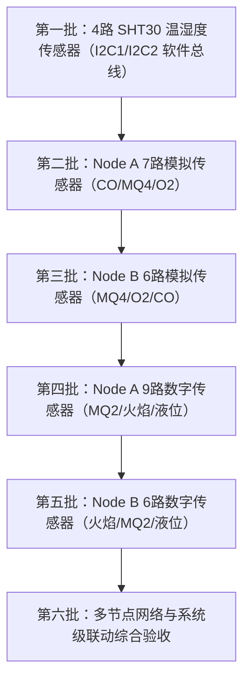

# 双节点多传感器实机调试与验收记录表

> **声明与状态说明**：
> 本文档为双节点多传感器扩展方案（32 路传感器）的标准实机调试流程与验收记录模版。
> **当前状态：待实机接入与现场通电验收（PENDING PHYSICAL HARDWARE ACCESS）**。
> 本工作区仅完成全部嵌入式软件实现、跨平台接口定义、时序契约与语法/模拟测试，**严禁在无真实硬件连接时虚构任何物理电压、模拟读数或伪造验收通过签字**。

---

## 1. 调试与通道使能顺序规范

各通道必须在断开 STM32 信号线、量测供电与调理电平无误后，严格按照如下批次逐一接入与使能，禁止批量接入导致故障无法溯源：

每接入一路传感器，均须执行以下两项单通道闭环验证：
1. **在线识别**：固件使能后，对应 `assetCode` 在遥测中正确上报，且无其他无关通道状态跳变。
2. **断线隔离**：拔出该传感器信号线，限定时间（陈旧窗口 5000 ms）内仅该 `assetCode` 变为 `missing`（或 `bad`），其他 31 路读数不受影响。

---

## 2. 32 路传感器分步调试记录

### 2.1 第一批：SHT30 温湿度传感器（4 路）

| 资产编号 | 节点 | 总线 | 地址 | 供电实测 (V) | I2C ACK 正常 | 温度初值 (°C) | 湿度初值 (%RH) | 拔出单路隔离测试 | 调试状态 | 测试人 / 日期 |
|---|---|---|---|---|---|---|---|---|---|---|
| `SHT-01` | Node A | A-I2C-1 | 0x44 | `[ ] ______` | `[ ]` 是 / `[ ]` 否 | `[ ] ______` | `[ ] ______` | `[ ]` 仅本路变 missing | `[ ]` 待接入 | `________ / ________` |
| `SHT-02` | Node A | A-I2C-1 | 0x45 | `[ ] ______` | `[ ]` 是 / `[ ]` 否 | `[ ] ______` | `[ ] ______` | `[ ]` 仅本路变 missing | `[ ]` 待接入 | `________ / ________` |
| `SHT-03` | Node A | A-I2C-2 | 0x44 | `[ ] ______` | `[ ]` 是 / `[ ]` 否 | `[ ] ______` | `[ ] ______` | `[ ]` 仅本路变 missing | `[ ]` 待接入 | `________ / ________` |
| `SHT-04` | Node A | A-I2C-2 | 0x45 | `[ ] ______` | `[ ]` 是 / `[ ]` 否 | `[ ] ______` | `[ ] ______` | `[ ]` 仅本路变 missing | `[ ]` 待接入 | `________ / ________` |

### 2.2 第二批：Node A 模拟气体传感器（7 路）

| 资产编号 | 传感器类型 | MCU ADC 引脚 | 模块供电 (V) | AO 静态实测 (V) | AO 激励最大 (V) | <= 3.3V 确认 | 遥测原始值 / 质量 | 标定与联动使能 | 调试状态 | 测试人 / 日期 |
|---|---|---|---|---|---|---|---|---|---|---|
| `CO-01` | 一氧化碳 | PC1 / ADC1_IN11 | `[ ] ______` | `[ ] ______` | `[ ] ______` | `[ ]` 合格 | `[ ]` raw: ____ / suspect | 仅遥测 (未标定) | `[ ]` 待接入 | `________ / ________` |
| `MQ4-01` | 甲烷 | PC2 / ADC1_IN12 | `[ ] ______` | `[ ] ______` | `[ ] ______` | `[ ]` 合格 | `[ ]` raw: ____ / good | 已标定，允许通风联动 | `[ ]` 待接入 | `________ / ________` |
| `O2-01` | 氧气 | PC3 / ADC1_IN13 | `[ ] ______` | `[ ] ______` | `[ ] ______` | `[ ]` 合格 | `[ ]` raw: ____ / suspect | 仅遥测 (未标定) | `[ ]` 待接入 | `________ / ________` |
| `CO-02` | 一氧化碳 | PA0 / ADC1_IN0 | `[ ] ______` | `[ ] ______` | `[ ] ______` | `[ ]` 合格 | `[ ]` raw: ____ / suspect | 仅遥测 (未标定) | `[ ]` 待接入 | `________ / ________` |
| `MQ4-02` | 甲烷 | PA4 / ADC1_IN4 | `[ ] ______` | `[ ] ______` | `[ ] ______` | `[ ]` 合格 | `[ ]` raw: ____ / suspect | 仅遥测 (未标定) | `[ ]` 待接入 | `________ / ________` |
| `O2-02` | 氧气 | PA5 / ADC1_IN5 | `[ ] ______` | `[ ] ______` | `[ ] ______` | `[ ]` 合格 | `[ ]` raw: ____ / suspect | 仅遥测 (未标定) | `[ ]` 待接入 | `________ / ________` |
| `CO-03` | 一氧化碳 | PB1 / ADC1_IN9 | `[ ] ______` | `[ ] ______` | `[ ] ______` | `[ ]` 合格 | `[ ]` raw: ____ / suspect | 仅遥测 (未标定) | `[ ]` 待接入 | `________ / ________` |

### 2.3 第三批：Node B 模拟气体传感器（6 路）

| 资产编号 | 传感器类型 | MCU ADC 引脚 | 模块供电 (V) | AO 静态实测 (V) | AO 激励最大 (V) | <= 3.3V 确认 | 遥测原始值 / 质量 | 标定与联动使能 | 调试状态 | 测试人 / 日期 |
|---|---|---|---|---|---|---|---|---|---|---|
| `MQ4-03` | 甲烷 | PA0 / ADC1_IN0 | `[ ] ______` | `[ ] ______` | `[ ] ______` | `[ ]` 合格 | `[ ]` raw: ____ / suspect | 仅遥测 (未标定) | `[ ]` 待接入 | `________ / ________` |
| `MQ4-04` | 甲烷 | PA1 / ADC1_IN1 | `[ ] ______` | `[ ] ______` | `[ ] ______` | `[ ]` 合格 | `[ ]` raw: ____ / suspect | 仅遥测 (未标定) | `[ ]` 待接入 | `________ / ________` |
| `MQ4-05` | 甲烷 | PA4 / ADC1_IN4 | `[ ] ______` | `[ ] ______` | `[ ] ______` | `[ ]` 合格 | `[ ]` raw: ____ / suspect | 仅遥测 (未标定) | `[ ]` 待接入 | `________ / ________` |
| `O2-03` | 氧气 | PA6 / ADC1_IN6 | `[ ] ______` | `[ ] ______` | `[ ] ______` | `[ ]` 合格 | `[ ]` raw: ____ / suspect | 仅遥测 (未标定) | `[ ]` 待接入 | `________ / ________` |
| `CO-04` | 一氧化碳 | PB0 / ADC1_IN8 | `[ ] ______` | `[ ] ______` | `[ ] ______` | `[ ]` 合格 | `[ ]` raw: ____ / suspect | 仅遥测 (未标定) | `[ ]` 待接入 | `________ / ________` |
| `CO-05` | 一氧化碳 | PB1 / ADC1_IN9 | `[ ] ______` | `[ ] ______` | `[ ] ______` | `[ ]` 合格 | `[ ]` raw: ____ / suspect | 仅遥测 (未标定) | `[ ]` 待接入 | `________ / ________` |

### 2.4 第四批：Node A 数字传感器（9 路）

| 资产编号 | 传感器类型 | MCU GPIO 引脚 | 供电 (V) | DO 高电平实测 (V) | DO 低电平实测 (V) | 去抖后极性匹配 | 报警注入响应 | 调试状态 | 测试人 / 日期 |
|---|---|---|---|---|---|---|---|---|---|
| `MQ2-01` | 烟雾/可燃气 | PB12 | `[ ] ______` | `[ ] ______` | `[ ] ______` | `[ ]` 低电平有效 | 4次稳定后报警 | `[ ]` 待接入 | `________ / ________` |
| `FLAME-01` | 火焰 | PB14 | `[ ] ______` | `[ ] ______` | `[ ] ______` | `[ ]` 低电平有效 | 立即报警且保持12s | `[ ]` 待接入 | `________ / ________` |
| `LEVEL-01` | 液位 | PC0 | `[ ] ______` | `[ ] ______` | `[ ] ______` | `[ ]` 低电平有效 | 4次去抖后翻转 | `[ ]` 待接入 | `________ / ________` |
| `FLAME-02` | 火焰 | PC8 | `[ ] ______` | `[ ] ______` | `[ ] ______` | `[ ]` 低电平有效 | 4次去抖 | `[ ]` 待接入 | `________ / ________` |
| `FLAME-03` | 火焰 | PC9 | `[ ] ______` | `[ ] ______` | `[ ] ______` | `[ ]` 低电平有效 | 4次去抖 | `[ ]` 待接入 | `________ / ________` |
| `MQ2-02` | 烟雾/可燃气 | PC10 | `[ ] ______` | `[ ] ______` | `[ ] ______` | `[ ]` 低电平有效 | 4次去抖 | `[ ]` 待接入 | `________ / ________` |
| `MQ2-03` | 烟雾/可燃气 | PC11 | `[ ] ______` | `[ ] ______` | `[ ] ______` | `[ ]` 低电平有效 | 4次去抖 | `[ ]` 待接入 | `________ / ________` |
| `LEVEL-02` | 液位 | PC12 | `[ ] ______` | `[ ] ______` | `[ ] ______` | `[ ]` 低电平有效 | 4次去抖 | `[ ]` 待接入 | `________ / ________` |
| `LEVEL-03` | 液位 | PC13 | `[ ] ______` | `[ ] ______` | `[ ] ______` | `[ ]` 低电平有效 | 4次去抖 (高阻输入) | `[ ]` 待接入 | `________ / ________` |

### 2.5 第五批：Node B 数字传感器（6 路）

| 资产编号 | 传感器类型 | MCU GPIO 引脚 | 供电 (V) | DO 高电平实测 (V) | DO 低电平实测 (V) | 去抖后极性匹配 | 报警注入响应 | 调试状态 | 测试人 / 日期 |
|---|---|---|---|---|---|---|---|---|---|
| `FLAME-04` | 火焰 | PC6 | `[ ] ______` | `[ ] ______` | `[ ] ______` | `[ ]` 低电平有效 | 4次去抖 | `[ ]` 待接入 | `________ / ________` |
| `FLAME-05` | 火焰 | PC7 | `[ ] ______` | `[ ] ______` | `[ ] ______` | `[ ]` 低电平有效 | 4次去抖 | `[ ]` 待接入 | `________ / ________` |
| `MQ2-04` | 烟雾/可燃气 | PC8 | `[ ] ______` | `[ ] ______` | `[ ] ______` | `[ ]` 低电平有效 | 4次去抖 | `[ ]` 待接入 | `________ / ________` |
| `MQ2-05` | 烟雾/可燃气 | PC9 | `[ ] ______` | `[ ] ______` | `[ ] ______` | `[ ]` 低电平有效 | 4次去抖 | `[ ]` 待接入 | `________ / ________` |
| `LEVEL-04` | 液位 | PC10 | `[ ] ______` | `[ ] ______` | `[ ] ______` | `[ ]` 低电平有效 | 4次去抖 | `[ ]` 待接入 | `________ / ________` |
| `LEVEL-05` | 液位 | PC11 | `[ ] ______` | `[ ] ______` | `[ ] ______` | `[ ]` 低电平有效 | 4次去抖 | `[ ]` 待接入 | `________ / ________` |

---

## 3. 系统级综合验收门禁检查（Completion Gate）

按照设计规格书与实施计划，实机最终交付必须满足以下 10 项条件，目前记录状态均为待现场检验：

- [ ] **1. 引脚无冲突验证**：引脚映射测试证明未占用复位脚、晶振脚、SWD 下载调试脚与风机 PWM 关键引脚。
- [ ] **2. 32 路资产编号唯一性**：全部 32 个编号分别在 `ut/v1/CTRL-01/telemetry`（20 路）与 `ut/v1/CTRL-02/telemetry`（12 路）中出现。
- [ ] **3. ADC 绝对安全输入**：所有新接模拟通道在极限浓度/满幅输出时，示波器或万用表测得 MCU 引脚侧电压 <= 3.30 V。
- [ ] **4. 单点断线精准识别**：任拔一路传感器，仅该资产编号在双屏和 MQTT 遥测中变为 `missing`，其余传感器正常刷新。
- [ ] **5. 双屏北京时间同步**：在 32 路传感器全负载采样轮转下，两块屏幕顶栏北京时间均保持秒级连续更新，无卡死或停顿。
- [ ] **6. 菜单命令双向响应**：Node B 摇杆下发风机启停与占空比调节命令，在既定 5000 ms 超时内收到 Node A 的 `ut.command.ack.v1` 回执。
- [ ] **7. 手动控制与安全联锁隔离**：已验证的 `MQ4-01` 报警强制开启风机与声光，手动停风机被安全策略联锁（safety lockout）；告警清除并冷却 30 秒后恢复手动控制。
- [ ] **8. 报警定位精准显式覆盖**：触发任一报警通道时，报警弹窗显式标注具体资产编号（如 `FLAME-04 CRITICAL`），不得仅显示通用类名。
- [ ] **9. 未标定模拟量不误动作**：未标定的 CO 与氧气通道仅以 `suspect` 质量上报原始量与微伏电压，不驱动继电器、风机或蜂鸣器。
- [ ] **10. MQTT 断网自愈重连**：断开 Wi-Fi 路由后重新上电，两块 ESP8266-01S 均能在 15 秒内重新发现本地 Broker 并恢复遥测发布。
