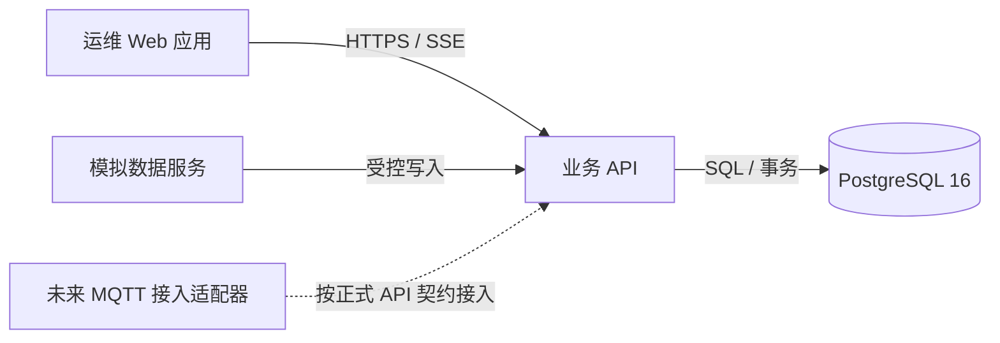

# 综合管廊软件企业级架构与数据设计

> 版本：v1.1 · 更新：2026-08-26 · 状态：P0/P1 前后端接入完成，待配置真实托管数据库

## 1. 目标与边界

本设计把当前演示型前端升级为可审计、可扩展、可部署的运维软件。业务核心采用 PostgreSQL 16；前端、API 和数据库严格分层。当前 Vue 3 + Django 主入口只使用模拟数据和业务 API，不建立硬件 MQTT 连接、不下发任何现场控制命令。



## 2. 模块边界

| 模块 | 唯一职责 | 不负责的内容 |
| --- | --- | --- |
| 数字孪生 | 区域、设备位置和运行状态的空间表达 | 告警确认、工单流转 |
| 资产台账 | 资产主数据、位置、能力、模型映射与生命周期 | 告警处置、统计报表 |
| 告警中心 | 异常事件的确认、升级、恢复、关闭和合并 | 任务派工与执行记录 |
| 工单中心 | 任务创建、派发、处置、复核和归档 | 直接修改告警事实 |
| 数据洞察 | 只读趋势、统计、日报与导出 | 改变业务状态 |
| 审计追踪 | 追加记录关键操作和状态变化 | 编辑或删除历史记录 |
| 系统配置 | 阈值、规则、映射、角色与数据保留策略 | 直接执行运维流程 |

告警可以创建工单，但两个模块各自保留状态机与历史记录；页面只通过关联 ID 跳转，避免业务职责重叠。

## 3. 数据库选型

使用托管 PostgreSQL 16 作为唯一主数据库：

- 资产、告警、工单与审计强关联，必须在同一事务中保持一致；
- PostgreSQL 的行级安全策略可限制不同角色看到或修改的行；
- 遥测数据使用按时间分区的关系表，保留后续扩展时序扩展的空间；
- 当前 GIS 定位使用经过校验的 WGS84 GeoJSON/JSONB 与标准化三维坐标，不依赖 PostGIS。只有经评审的迁移确实引入空间索引、精确相交或拓扑查询时，才在 PostgreSQL 16 兼容环境中单独启用 PostGIS，并同步更新最小权限与恢复演练。

首期不引入独立消息队列、缓存集群、时序数据库或搜索集群，避免为教学规模增加运维复杂度。高频数据规模显著增长后，再评估 TimescaleDB、Redis 和消息代理。

## 4. 核心实体

```text
区域 1 ── * 资产 1 ── * 遥测读数
                    └── * 告警 1 ── * 告警事件
                                  └── * 工单 1 ── * 工单事件
用户 * ── * 角色 ── * 权限
用户 / 系统操作 ── * 审计日志
```

| 数据域 | 主表 | 说明 |
| --- | --- | --- |
| 身份权限 | `app_user`、`role`、`permission`、`user_role` | 最小权限 RBAC，不在库中存明文密码 |
| 资产空间 | `zone`、`asset` | 资产编码与三维网格一一映射 |
| 实时历史 | `telemetry_reading` | 按采集时间分区，质量状态单独存储 |
| 事件闭环 | `alert`、`alert_event`、`work_order`、`work_order_event` | 告警和工单状态历史不可覆盖 |
| 治理 | `audit_log`、`system_setting`、`report_export` | 审计表禁止更新与删除 |

## 5. 安全基线

- 所有运行密钥只存放在部署环境变量，仓库仅保存 `.env.example`；
- 密码采用 Django PBKDF2 哈希与强度校验；访问令牌短时有效，不写入审计日志；
- API 使用 Bearer Token 鉴权、RBAC 授权、参数校验、统一错误码和请求追踪 ID；
- 业务写操作使用数据库事务，并追加审计记录；
- 生产数据库使用最小权限的应用账号、TLS、自动备份和恢复演练；
- 管理员配置数据库行级安全策略，应用账号不能拥有建表或删表权限。

## 6. 交付门槛

1. SQL 迁移可在空 PostgreSQL 实例完整执行；
2. API 通过编译、单元测试和接口测试；
3. 关键闭环为“告警确认 → 创建工单 → 处置 → 复核 → 审计”；
4. 前端只使用构建时固定的 Django API；无数据库时明确阻断业务页面，不伪造已持久化数据；
5. 每次可交付改动均完成检查、提交并推送。

## 7. 外部依赖与下一步

P0/P1 已交付前端登录、API 数据源切换、服务端 RBAC、资产检索、告警/工单闭环、手工工单、阈值版本化、报表导出登记和审计回读；接口约定见 [API 契约](api-contract.md)。

要完成真实数据持久化和最终部署，仍需要项目负责人提供一个托管 PostgreSQL 实例的连接地址与专用应用账号，或明确授权创建一个实例。未获得该授权前，可完成全部代码、迁移、模拟数据与自动化测试，但不会宣称数据库已上线。
